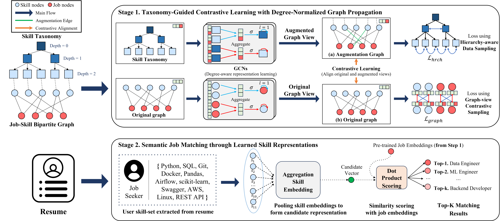

# Taxonomy-Guided Contrastive Learning with Competency-Calibrated Graphs for Job Recommendation

This repository provides the official implementation of **TaxoCal**, proposed in the CIKM 2026 short paper **"Taxonomy-Guided Contrastive Learning with Competency-Calibrated Graphs for Job Recommendation"**.

## Overview
We propose a contrastive representation learning framework that captures path-aware, depth-sensitive, and degree-informed signals within a heterogeneous job-skill bipartite graph.




## Environment

Developed and verified on Python 3.10.16, PyTorch 2.4.1 + CUDA 11.8, single NVIDIA GPU.

```bash
conda create -n taxocal python=3.10
conda activate taxocal

# install PyTorch matching your CUDA version first
pip install torch==2.4.1 --index-url https://download.pytorch.org/whl/cu118

pip install -r requirements.txt
```

A CUDA GPU is required. `pretrain_taxonomy.py` and `train_graph.py` move the normalized adjacency matrices to the device with an unconditional `.cuda()` call, so CPU-only execution is not supported.


## Data preparation

No data is bundled. The full preprocessing pipeline is published under [`preprocessing/`](preprocessing/), so the datasets can be rebuilt from the original sources.

Text embeddings come from `bert-base-uncased`, taking the `[CLS]` token of the last hidden state (768-d per label). The job-skill graph and the skill taxonomy use the same encoder, so the two contrastive views share one embedding space.

```bash
pip install -r preprocessing/requirements.txt

python preprocessing/collectors.py                  # optional: scrape ESCO level-4 concepts
python preprocessing/formats.py                     # assign skill ids, emit index files
python preprocessing/aug_graph_maker.py             # -> data/h_dataset.pkl
python preprocessing/main_graph_pickle_makers.py    # -> data/dataset.pkl

python inspect_data.py                              # print what you built
```

Three pickles end up in `data/`:

| File | Built by | Used by |
|---|---|---|
| `h_dataset.pkl` | `preprocessing/aug_graph_maker.py` | `pretrain_taxonomy.py` |
| `dataset.pkl` | `preprocessing/main_graph_pickle_makers.py` | `train_graph.py` |
| `inference.pkl` | resume-to-ESCO matching (see below) | `train_matching.py` |

`inspect_data.py` prints the on-disk structure of whatever you build (keys, shapes, dtypes, sample entries), so a rebuild can be checked against what the training code expects. Full schemas are in [`data/README.md`](data/README.md), and the pipeline is described in [`preprocessing/README.md`](preprocessing/README.md).

Note that skill ids are assigned by first appearance while scanning `esco_hierarchy.csv`, not taken from a stable ESCO identifier. All three pickles share one id space, so rebuild them together rather than mixing regenerated files with older ones.

ESCO must be downloaded from the European Commission portal under its own terms. The resume corpus behind `inference.pkl` is not redistributed, since it contains personal data. `inference.pkl` itself stores only integer ids and holds no personal information.


## Training

```bash
bash scripts/train.sh
```

Or stage by stage:

```bash
python pretrain_taxonomy.py   # -> checkpoints/200_aug_checkpoints.pth
python train_graph.py         # -> checkpoints/100_checkpoints.pth, 200_checkpoints.pth
python train_matching.py      # -> checkpoints/matching_checkpoints.pth
```


## Evaluation

`train_matching.py` scores the held-out test split when training finishes, and every 10 epochs along the way. It reports HitRate, Accuracy, NDCG and MRR at k = 3, 5, 10, plus per-user AUC over all candidate jobs. All metrics are computed by `utils.py`.

The train/valid/test partition is a 50/10/40 `random_split` over `inference.pkl`. Passing `--seed N` makes it deterministic; omitting it keeps the original behavior, where the split is redrawn on every run and the metrics vary between runs. Users with an empty skill list are skipped, so the metric denominator is smaller than the test split.

## References

If you find this work useful in your research, please cite our paper.

```bibtex

```
